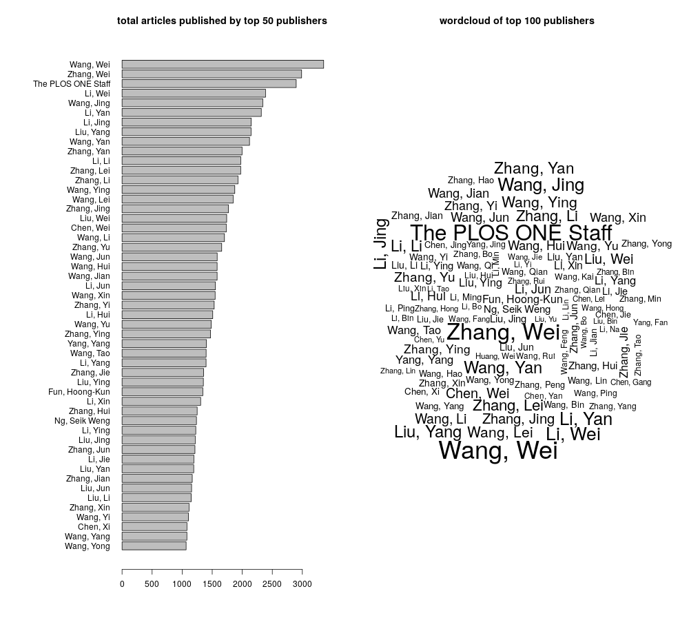

# JATSdecoder
A meta data and text extraction and manipulation tool set for the statistical programming language [R](www.r-project.org). 

**JATSdecoder** facilitates text mining projects on scientific reasearch papers by enabeling an individual selection of meta data and text parts. 
Its function `JATSdecoder()` extracts meta data, sectioned text and reference list from [NISO-JATS](https://jats.nlm.nih.gov/publishing/tag-library/1.1d2/index.html) coded XML files. 
Wheras `study.character()` uses the `JATSdecoder()` result to perform fine tuned text extraction tasks to identify key study characteristics like statistical methods used, alpha-error, statistical results reported in text and others. 

Note: PDF article collections can be converted to NISO-JATS coded XML files with the open source software [CERMINE](https://github.com/CeON/CERMINE).

**JATSdecoder** supplies some convenient functions to work with textual input in general. 
Its function `text2sentences` is especially designed to break floating text with scientific content (references, results) into sentences. 
`text2num()` unifies representations of written numbers and special annotations (percent, fraction, e+10) into digit numbers. 
You can extract adjustable n words around a pattern match in a sentence with `ngram()`. 
`letter.convert()` unifies hexadecimal to unicode characters and, if [CERMINE](https://github.com/CeON/CERMINE) generated CERMXML files are processed, special error correction and special letter uniformisation is performed, which is extremely relevant for `get.stats()`'s ability to extract and recompute statistical results in text. 

The contained functions are listed below. For a detailed description see the full [manual]().

- **JATSdecoder::JATSdecoder()** uses functions that can be applied stand alone on NISO-JATS coded XML files or text input:
  - get.title()      # extracts title                
  - get.author()     # extracts author/s as vector   
  - get.aff()        # extracts involved affiliation/s as vector
  - get.journal()    # extracts journal
  - get.vol()        # extracts journal volume as vector
  - get.doi()        # extracts Digital Object Identifier
  - get.history()    # extracts publishing history as vector with available date stamps
  - get.country()    # extracts country/countries of origin as vector with unique countries
  - get.type()       # extracts document type
  - get.subject()    # extracts subject/s as vector
  - get.keywords()   # extracts keyword/s as vector
  - get.abstract()   # extracts abstract
  - get.text()       # extracts sections and text as list
  - get.references() # extracts reference list as vector


- **JATSdecoder::study.character()** applies several functions on specific elements of the `JATSdecoder()` result and can be used stand alone on any plain text input:
  - get.n.studies()   # extracts number of studies from sections or abstract
  - get.alpha.error()  # extracts alpha error from text 
  - get.method()  # extracts statistical methods from method and result section with `ngram()`
  - get.stats()  # extracts statistical results reported in text (abstract and full text, method and result section, result section only) 
  - get.software()  # extracts software name/s mentioned in method and result section with dictionary search
  - get.R.package()  # extracts mentioned R package/s in method and result section with dictionary search on all available R packages created with `available.packages()`
  - get.power()  # extracts power (1-beta-error) if mentoioned in text
  - get.assumption()  # extracts mentioned assumptions from method and result section with dictionary search
  - get.multiple.comparison()  # extracts correction method for multiple testing from method and result section with dictionary search
  - get.sig.adjectives()  # extracts common inadequate adjectives used before *signignificant* and *not significant* 

- **JATSdecoder helper functions** are helpfull for many text mining project and straight forward to use on any textual input:
  - text2sentences() # breaks floating text into sentences
  - text2num() # converts spelled out numbers, fractions, potencies, percentages and numbers denoted with e+num to decimals
  - ngram() # creates n gram of words around a pattern match in text 
  - strsplit2() # splits text at pattern match with option "before" or "after" and without removing the pattern match 
  - letter.convert() # converts many hexadecimal and HTML characters to unicode and performs CERMINE specific error correction
  - which.term() # returns hit vector for a set of patterns to search for in text (can be reduced to hits only)

### Built With
* [R Core 3.6](https://www.r-project.org)
* [RKWard](https://rkward.kde.org/)
* [devtools](https://github.com/r-lib/devtools) package

<!-- GETTING STARTED -->
## Getting Started

To install **JATSdecoder** run the follow steps:

### Installation
1. Install and load the [devtools](https://github.com/r-lib/devtools) package
``` r
# Install the devtools package
install.packages("devtools")
# Load the devtools package
library(devtools)
``` 
2. Install *JATSdecoder from [github](https://github.com/ingmarboeschen/JATSdecoder)
``` r
# Install JATSdecoder from github
install_github("ingmarboeschen/JATSdecoder")
```


<!-- USAGE EXAMPLES -->
## Usage for a single XML file
Here a simple download of a NISO-JATS coded XML file is performed with `download.file()`:
``` r
# load package
library(JATSdecoder)
# download example XML file via URL
URL <- "https://journals.plos.org/plosone/article/file?id=10.1371/journal.pone.0114876&type=manuscript"
download.file(URL,"file.xml")
# convert full article to list with meta data, sectioned text and reference list
JATSdecoder("file.xml")
# extract specific content (here: abstract)
JATSdecoder("file.xml",output="abstract")
get.abstract("file.xml")
# extract study characteristics as list
study.character("file.xml")
# extract specific study characteristic (here: statistical results)
study.character("file.xml",output=c("stats","standardStats")) 
# reduce to checkable results only
study.character("file.xml",output="standardStats",stats.mode="checkable")
# compare with result of statcheck's function checkHTML() (Epskamp & Nuijten, 2018)
install.packages("statcheck")
library(statcheck)
checkHTML("file.xml")
```

## Usage for a collection of XML files
The PubMed Central data base offers more than 3 million documents related to the biology and health sciences. The full repository is bulk downloadable as NISO-JATS coded NXML documents here: [PMC bulk download](https://ftp.ncbi.nlm.nih.gov/pub/pmc/oa_bulk/). 

1. Get file names from working directory
``` r
setwd("/home/PMC") # May be you would like to choose a certain journal folder instead for testing
files<-list.files(pattern="XML$|xml$",recursive=TRUE)
``` 
2. Apply extraction of article content to all files (replace `lapply()` with `future.apply()` from [future.apply](https://github.com/HenrikBengtsson/future.apply) package for multi core processing)
``` r
library(JATSdecoder)
# extract full article content
JATS<-lapply(files,JATSdecoder)
# extract single article content (here: abstract)
abstract<-lapply(files,JATSdecoder,output="abstract")
# or
abstract<-lapply(files,get.abstract)
# extract study characteristics
character<-lapply(files,study.character)
```
3. Working with a list of `JATSdecoder()` results
``` r
# first article content as list
JATS[[1]] 
character[[1]] 
# names of all extractable elements
names(JATS[[1]])
names(character[[1]])
# extract one element only (here: title, abstract, history)
lapply(JATS,"[[","title") 
lapply(JATS,"[[","abstract") 
lapply(JATS,"[[","history") 
# extract year of publication from history tag
unlist(lapply(JATS,"[[","history") ,"[","pubyear")
``` 
4. Examples for converting, unifying and selecting text with helper functions
``` r
# extract full text from all documents
text<-lapply(JATS,"[[","text") 
# convert floating text to sentences
sentences<-lapply(text,text2sentences)
sentences
# only select sentences with pattern and unlist article wise
pattern<-"significant"
hits<-lapply(sentences,function(x) grep(pattern,x,value=T))
hits<-lapply(hits,unlist)
hits
# number of sentences with pattern
lapply(hits,length)
# unify written numbers, fractions, percentages, potencies and numbers denoted with e+num to digit number
lapply(text,text2num)
``` 

## Exemplary analysis of some NISO-JATS tags
Next some example analysis are performed on the full PMC article collection. As each variable is very memory consuming you might want to reduce your analysis to a smaller amount of articles. 

1. Extract JATS for article collection 
Replace `lapply()` with `future.apply()` from [future.apply](https://github.com/HenrikBengtsson/future.apply) package for multi core processing.
```r
# load package
library(JATSdecoder)
# set working directory
setwd("/home/foldername")
# get XML file names
files<-list.files(patt="xml$|XML$")
# extract JATS
JATS<-lapply(files,JATSdecoder)
```

2. Analyse distribution of publishing year
```r
# extract and numerize year of publication from history tag
year<-unlist(lapply(lapply(JATS,"[[","history") ,"[","pubyear"))
year<-as.numeric(year)
# frequency table
table(year)
# display absolute number of published documents per year in barplot
# with factorized year
year<-factor(year,min(year,na.rm=TRUE):max(year,na.rm=TRUE))
barplot(table(year),las=1,xlab="year",main="absolute number of published PMC documents per year")
# display cummulative number of published documents in barplot
barplot(cumsum(table(year)),las=1,xlab="year",main="cummulative number of published PMC documents")
``` 


3. Analyse distribution of document type
```r
# extract document type
type<-unlist(lapply(JATS ,"[","type"))
# increase left margin of grafik output
par(mar=c(5,12,4,2)+.1)
# display in barplot
barplot(sort(table(type)),horiz=TRUE,las=1)             
# set margins back to normal
par(mar=c(5,4,4,2)+.1)
``` 


4. Find most frequent authors

NOTE: author names are not stored fully consistent. Some first and middle names are abbreviated, first names are follwed by last names and vice versa!

```r
# extract author
author<-lapply(JATS ,"[","author")
# top 100 most present author names 
tab<-sort(table(unlist(author)),dec=T)[1:100]
# frequency table
tab
# display in barplot
# increase left margin of grafik output
par(mar=c(5,12,4,2)+.1)
barplot(tab,horiz=TRUE,las=1)             
# set margins back to normal
par(mar=c(5,4,4,2)+.1)
# display in wordcloud with wordcloud package
library(wordcloud)
wordcloud(names(tab),tab)
``` 


## References
<div id="refs" class="references">
<div id="CERMINE">
- National Center for Biotechnology Information (NCBI), National Library of Medicine (NLM). 2014. Journal Publishing Tag Library - NISO JATS Draft Version 1.1d2. 
[https://jats.nlm.nih.gov/publishing/tag-library/1.1d2/index.html].
</div>

<div id="JATS">
- Dominika Tkaczyk, Pawel Szostek, Mateusz Fedoryszak, Piotr Jan Dendek and Lukasz Bolikowski. 
CERMINE: automatic extraction of structured metadata from scientific literature. 
In International Journal on Document Analysis and Recognition (IJDAR), 2015, 
vol. 18, no. 4, pp. 317-335, doi: 10.1007/s10032-015-0249-8. 
[https://github.com/CeON/CERMINE/].
</div>
</div>

<!-- ACKNOWLEDGEMENTS -->
## Acknowledgements
This software is part of a dissertation project about the evolution of methodological characteristics in psychological research and financed by a grant awarded by the Department of [Psychological Methods and Statistics](https://www.psy.uni-hamburg.de/arbeitsbereiche/psychologische-methoden-und-statistik.html), [Institute of Psychology](https://www.psy.uni-hamburg.de/), [University Hamburg](https://www.uni-hamburg.de/), Germany.  
